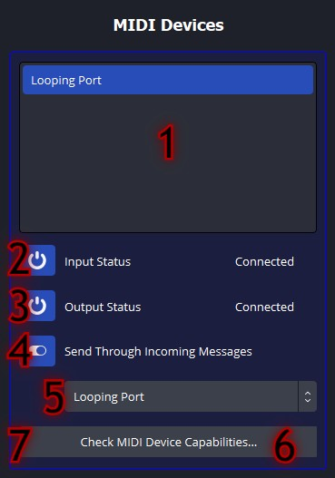
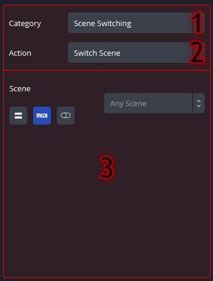

# obs-midi-mg Plugin Operation Manual

## Contents
   - [The Basics](#the-basics)
      - [Fields](#fields)
      - [MIDI Buttons](#midi-buttons)
   - [Devices](#devices)
      - [Device Editor](#device-editor)
   - [Messages](#messages)
      - [Message Editor](#message-editor)
   - [Actions](#actions)
      - [Action Editor](#action-editor)
   - [Bindings](#bindings)
      - [Binding Editor](#binding-editor)
      - [Selectiing Binding Contents](#selecting-binding-contents)
   - [Preferences](#preferences)

## The Basics

This is what will be displayed when opening the menu for the first time. Descriptions for each number are provided.

1. ***Add Button***: When clicked, a new object will appear in the Access Panel.
2. ***Duplicate Button***: When clicked, a new object will appear in the Access Panel that contains the same data values as the currently selected object.
3. ***Delete Button***: When clicked, the currently selected object will be permanently removed from the Access Panel. This operation cannot be undone.

 

4. ***Header***: When the view mode changes, this text will describe the type of objects displayed in the Access Panel.

 

5. ***Bindings Button***: When clicked, the Access Panel will display all loaded Bindings.
6. ***Devices Button***: When clicked, the Access Panel will display all loaded MIDI Devices.
7. ***Messages Button***: When clicked, the Access Panel will display all loaded Messages.
8. ***Actions Button***: When clicked, the Access Panel will display all loaded Actions.
9. ***Preferences Button***: When clicked, the Preferences menu will be displayed.

 

10. ***Access Panel***: All plugin objects are displayed here in list form. Clicking on an object displays its properties in the Editor Panel. Double clicking on an object allows for the object to be renamed (does not apply to MIDI Devices or the Preferences menu).
11. ***Editor Panel***: The properties from a selected object in the Access Panel are displayed here.

### Fields

When setting up the plugin, these two fields will appear everywhere. Knowing what each does is important in maximizing the potential of the plugin.

***Number Field***: This field holds a single number value, or a range between two numbers. The number on top is the lower end of the range, and the number on the bottom is the higher end of the range. (These can be switched to provide an inverted effect.) Certain fields also provide a toggling effect, where the field will alternate between the two selected values, starting with the top value.

***String Field***: This field holds a single string value, and is not normally used with the MIDI customizations.

### MIDI Buttons

These buttons customize the field they are in.

-  When a field is in *Fixed* mode, the plugin will use the value that is displayed in the field. 

-  When a field is in *MIDI* mode, the plugin will use a value mapped from the Message's range to the range of values used in the field. (e.g. in a Video Sources: Rotate Source Action, a Message sent with a value of 64 and was accepted in MIDI mode will translate to the source rotating about 180 degrees.) 

-  When a field is in *Custom* mode, the plugin will also use a value mapped from the Message's range to the range of values used in the field,  but the range is not the default range. (e.g. in a Video Sources: Rotate Source Action, a Message sent with a value of 64 and was accepted in Custom mode with a range from 34 to 99 will translate to the source rotating about 166 degrees.) 

-  When a field is in *Ignore* mode, the plugin will ignore the value in that field. This is the most useful when having to set two values, but only one needs to change (e.g. in Video Sources: Move Source or Source Scale Actions).

-  When a field is in *Toggle* mode, the plugin will toggle between the two values displayed in the field, starting with the top value.

Now on to the main concepts.

## Devices

MIDI Devices provide the basis for the plugin - without them, this plugin would not exist. In the plugin, MIDI Devices can be controlled for both input and output to interact with OBS. To use them, they must be *Connected*, otherwise no activity will occur.

### Device Editor

1. ***Input Status Button***: When clicked, the currently selected MIDI Device will toggle its input port activation. When enabled, this will attempt to open the MIDI device's input port and, if successful, will update the status to *Connected*. The status will read *Disconnected* if the input port is not open, and *Unavailable* if the MIDI device has no input port.
2. ***Send Through Button***: When clicked, the currently selected MIDI Device will change whether to use a throughput Device. When enabled, all messages sent to this MIDI device will automatically be sent to the selected MIDI Device in the **Send Through MIDI Device Options** field (provided that that MIDI Device's output port is *Connected*).
3. ***Send Through MIDI Device Options***: When an option is selected, the throughput MIDI device for the currently selected MIDI Device will be set.

 

4. ***Output Status Button***: When clicked, the currently selected MIDI Device will toggle its output port activation. When enabled, this will attempt to open the MIDI device's output port and, if successful, will update the status to *Connected*. The status will read *Disconnected* if the output port is not open, and *Unavailable* if the MIDI device has no output port.

## Messages

MIDI Messages are composed of a type, channel, and (usually) other values. These values can be inputted manually or, by using the *Listen to Message* feature, can be inputted by the MIDI device automatically. 

Messages are now very much customizable, as every field can now depend on MIDI input. The Value/Velocity field is still the only field that can be used in an Action, but all other fields can be used to allow Actions to execute in a Binding.

When being sent to an output MIDI Device, non-Fixed field states will be filled in as closely as possible to either a) the Action that occurred to trigger the send, or b) the Message that caused it to be sent (e.g. from a MIDI Device sending to its throughput MIDI Device).

### Message Editor

1. ***Message Type***: When an option is selected, the currently selected Message object's type is updated.
2. ***Message Channel***: The number values displayed represent the currently selected Message object's channel.
3. ***Message Data***: The number values displayed represent the currently selected Message object's primary value (with Note and Control messages). This field will not appear if there is no secondary value in the message.
4. ***Message Data***: The number values displayed represent the currently selected Message object's secondary value (with Note and Control messages) or primary value (with Program and Pitch messages). This field will always appear.
 
 (See the Messages Guide for more info about what goes on in each field) (NOT AVAILABLE YET!) 

 

5. ***Listen Button: Once***: When clicked, all MIDI devices with open input ports will be checked for incoming messages. All Bindings will be disabled when this is activated. When a message is received, the currently selected Message object will be updated to match that message. After that message has been received, the listening will be deactivated on its own, and all Bindings will be enabled again.
6. ***Listen Button: Continuous***: When clicked, all MIDI devices with open input ports will be checked for incoming messages. All Bindings will be disabled when this is activated. When a message is received, the currently selected Message object will be updated to match that message. Listening will not be deactivated on its own, so it will need to be deactivated manually - otherwise all Bindings will be disabled.
 
 NOTE: In previous versions, these buttons were MIDI device specific. This is no longer the case, as now all MIDI devices are checked for with this feature.

## Actions

Actions are composed of a category, action identification, and type. Additional fields are changed dynamically when the categories and identifications are changed. 

Actions can be used in either Input or Output mode. In Input mode, the Action will execute using the Message provided from the Binding it came from. In Output mode, the Action will wait for any occurrences of its values, and it will notify any Bindings it may be associated with.

More information on specific action values can be found in the [Actions Guide](actions-guide.md).

### Action Editor

1. ***Action Categories***: When an option is selected, the currently selected Action object will be updated to accomodate to the selected category by providing options in **Category-Specific Action Options**. NOTE: This will delete all previous Action object data permanently!
2. ***Action Switch Button***: When clicked, a message box will appear describing what happens when the Action object's type is changed. If confirmed, the currently selected Action will toggle its mode, otherwise nothing happens. When the down arrow is filled in, the Action is in Input mode, and when the up arrow is filled in, the Action is in Output mode.
3. ***Category-Specific Action Options***: When an option is selected, the Action object will accomodate to the specific option by providing fields in **Action Editor**.
4. ***Action Editor***: The fields of an Action object are displayed here. See the [Actions Guide](actions-docs.md) for more details.

## Bindings

The Binding is the glue that brings the plugin together. Bindings allow MIDI Devices to interact with Actions, giving the largest customization in the plugin.

Bindings, like Actions, can be used in either Input or Output mode. In Input mode, the Binding will listen for any incoming Messages from any of its selected MIDI Devices to match with its selected Message, and upon match will execute all of its Actions. In Output mode, the Binding will listen for any Actions to occur (usually within OBS), and upon occurrence, will send all of its Messages to all of its selected MIDI Devices. *(In both modes, the priority of execution occurs from top to bottom.)*

Bindings can be disabled, which completely removes it from any MIDI Device listening or Action occurrences until it is enabled again.

Bindings placed higher up in the selection list will have higher priority when executing (i.e. the first binding in the list will be dealt with before the second one).

### Binding Editor

1. ***Enable Button***: When clicked, the currently selected Binding will change its enabled state. When enabled in Input mode, this will connect it with its MIDI Devices so that it can check for its message. When enabled in Output mode, this will connect it with its Action so that it can check for the Action's occurrence.
2. ***Binding Switch Button***: When clicked, a message box will appear describing what happens when the Binding object's type is changed. If confirmed, the currently selected Binding will toggle its mode, otherwise nothing happens. When the down arrow is filled in, the Binding is in Input mode, and when the up arrow is filled in, the Binding is in Output mode. NOTE: The Message and Action sections swap when the Binding type changes.

 

3. ***Device Selection Button***: When clicked, the Access Panel will display all MIDI Devices that support the Binding type (i.e. an output only MIDI Device cannot be used in a Binding with an Input type). When one or more MIDI Devices have been selected (see [below](#selecting-binding-contents)), their names will be displayed in this section.
4. ***Message Selection Button***: When clicked, the Access Panel will display all Message objects. When one or more Message objects have been selected (see [below](#selecting-binding-contents)), their names will be displayed in this section.
5. ***Action Selection Button***: When clicked, the Access Panel will display all Action objects that support the Binding type (i.e. an Action object with an Output type cannot be used in a Binding with an Input type). When one or more Action objects have been selected (see [below](#selecting-binding-contents)), their names will be displayed in this section.
6. ***Preferences Selection Button***: When clicked, the Access Panel will display the preferences for the Binding.

### Selecting Binding Contents

1. ***Selection Header***: When selecting the contents of a Binding, the Header will update accordingly.
2. ***Selection Instructions***: These instructions describe the behavior of most selections of Binding contents. There are a couple of exceptions to these rules: 
- The Binding has an Input type and a Message object is being chosen 
- The Binding has an Output type and an Action object is being chosen  
In these cases, only ONE object can be selected per Binding.  
This area is also where the Binding Preferences will be located.
3. ***Confirmation Button***: When clicked, the selected objects are saved to the Binding, and the Bindings view reappears with the updated contents. Contents will NOT be saved if this button is not clicked!

## Preferences

1. ***Preferences Editor***: The preferences are displayed here. Explanations of each preference are provided in the plugin itself.
2. ***Export Button***: When clicked, the file dialog will open to save the .json configuration file generated by the plugin.
3. ***Import Button***: When clicked, the file dialog will open to open a .json configuration file, and the plugin will attempt to read it and update the display.
4. ***Help Button***: When clicked, the [Help](README.md) page opens.
5. ***Report A Bug Button***: When clicked, the [Issues](https://www.github.com/nhielost/obs-midi-mg/issues) page opens.
6. ***Updates Button***: When clicked, the [Releases](https://www.github.com/nhielost/obs-midi-mg/releases) page opens.
7. ***Author***: The creator of the plugin.
8. ***Version***: The plugin version (v3.0.0 at the time of this writing).
