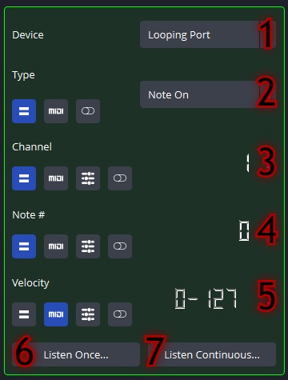

# obs-midi-mg Plugin Operation Manual

## Contents
   - [The Basics](#the-basics)
      - [The Main Menu](#the-main-menu)
      - [Fields](#fields)
      - [MIDI Buttons](#midi-buttons)
   - [Binding Collections](#binding-collections)
      - [Binding Collection Editor](#binding-collection-editor)
   - [Devices](#devices)
      - [Device Editor](#device-editor)
   - [Messages](#messages)
      - [Message Editor](#message-editor)
   - [Actions](#actions)
      - [Action Editor](#action-editor)  
   - [Bindings](#bindings)
      - [Binding Editor](#binding-editor) 
   - [Preferences](#preferences)

## The Basics

### The Main Menu

This is exactly what will appear when opening the plugin for the first time (except for the device list, of course). Each display in the plugin will reside in one of these three panels. The Main Menu consists of the *Binding Collections* panel, the *MIDI Devices* panel, and the *Preferences* panel. These panels are color coded to make it easier to distinguish between them. More details explaining each panel are outlined below.

### Fields

When setting up the plugin, these two fields will appear everywhere. Knowing what each does is important in maximizing the potential of the plugin.

***Number Field***: This field holds a single number value, or a range between two numbers. The number on top is the lower end of the range, and the number on the bottom is the higher end of the range. (These can be switched to provide an inverted effect.) Certain fields also provide a toggling effect, where the field will alternate between the two selected values, starting with the top value.

*Starting in version 3.0.0, these fields can be typed into when double-clicked to provide an easier method to input values. The other methods, such as using the scroll wheel, are still available to use as well.*

***String Field***: This field holds a single string value, and is not normally used with the MIDI customizations.

### MIDI Buttons

These buttons customize the field they are in.

| MIDI Button                                                         | Description                                                                                                                                                                                                                                                                                                                                                                                  |
|---------------------------------------------------------------------|----------------------------------------------------------------------------------------------------------------------------------------------------------------------------------------------------------------------------------------------------------------------------------------------------------------------------------------------------------------------------------------------|
|       | When a field is in *Fixed* mode, the plugin will use the value that is displayed in the field.                                                                                                                                                                                                                                                                                               |
|         | When a field is in *MIDI* mode, the plugin will use a value mapped from the Message's range to the range of values used in the field. (e.g. in a Video Sources: Rotate Source Action, a Message sent with a value of 64 and was accepted in MIDI mode will translate to the source rotating about 180 degrees.)                                                                              |
|     | When a field is in *Custom* mode, the plugin will also use a value mapped from the Message's range to the range of values used in the field,  but the range is not the default range. (e.g. in a Video Sources: Rotate Source Action, a Message sent with a value of 64 and was accepted in Custom mode with a range from 34 to 99 will translate to the source rotating about 166 degrees.) |
|    | When a field is in *Ignore* mode, the plugin will ignore the value in that field. This is the most useful when having to set two values, but only one needs to change (e.g. in Video Sources: Move Source or Source Scale Actions).                                                                                                                                                          |
|  | When a field is in *Toggle* mode, the plugin will toggle between the two values displayed in the field, starting with the top value.                                                                                                                                                                                                                                                         |

Now on to the main concepts.

## Binding Collections

Binding Collections are basically a grouping tool to keep Bindings organized. Binding Collections serve no other purpose than to keep the plugin organized while it is being used.

### Binding Collection Editor

1. ***Binding Collection Selector***: All Binding Collections that have been created are displayed here. Clicking on a Binding Collection's name will display all relevant information in the fields below. Double clicking the Binding Collection's name will provide the option to rename it.

2. ***Add Binding Collection Button***: When clicked, a new Binding Collection will be displayed in the **Binding Collection Selector**.

3. ***Binding Collection Info***: Displays the number of Bindings in the currently selected Binding Collection for convenience.

4. ***Edit Binding Collection Button***: When clicked, the display will change and the **Binding Selector** will be displayed with all the Bindings in the currently selected Binding Collection.

5. ***Remove Binding Collection Button***: When clicked, a confirmation window will appear, ensuring that removing the currently selected Binding Collection was intended. If it was, the Binding Collection will be deleted forever, along with all of the Bindings inside.

## Devices

MIDI Devices provide the basis for the plugin - without them, this plugin would not exist. In the plugin, MIDI Devices can be controlled for both input and output to interact with OBS Studio. To use them, they must be *Connected*, otherwise no activity will occur.

### Device Editor

1. ***MIDI Device Selector***: The MIDI Devices currently available to the plugin will appear here in list form. Clicking on the Device's name will display all relevant information in the fields below. In most cases, MIDI Devices will automatically be added or removed based on the availability of the device.

2. ***Input Status Button***: When clicked, the currently selected MIDI Device will toggle its input port activation. When enabled, this will attempt to open the MIDI device's input port and, if successful, will update the status to *Connected*. The status will read *Disconnected* if the input port is not open, and *Unavailable* if the MIDI device has no input port.

3. ***Output Status Button***: When clicked, the currently selected MIDI Device will toggle its output port activation. When enabled, this will attempt to open the MIDI device's output port and, if successful, will update the status to *Connected*. The status will read *Disconnected* if the output port is not open, and *Unavailable* if the MIDI device has no output port.

4. ***Send Through Button***: When clicked, the currently selected MIDI Device will change whether to use a throughput Device. When enabled, all messages sent to this MIDI device will automatically be sent to the selected MIDI Device in the **Send Through MIDI Device Options** field (provided that that MIDI Device's output port is *Connected*).

5. ***Send Through MIDI Device Options***: When an option is selected, the throughput MIDI device for the currently selected MIDI Device will be set.

6. ***MIDI Device Capability Button***: When clicked, the plugin will check the currently selected MIDI Device to ensure that its ports are available to connect to, and after this check, the above fields will update to reflect any changes the plugin finds. 

7. ***Remove Device Button***: Although not pictured here, a button will appear in this location if a MIDI Device is detected without any way to connect to it. When clicked, the plugin will remove the selected MIDI Device from the list, and it cannot be recovered unless the MIDI device is detected again. In order to detect a removed device again, the plugin may require a reboot, as that device has already been registered with the plugin (this is only true in some cases).

## Messages

MIDI Messages are composed of a type, channel, and (usually) other values. These values can be inputted manually or, by using the *Listen to Message* feature, can be inputted by the MIDI device automatically. 

Messages are now very much customizable, as every field can now depend on MIDI input. The Value/Velocity field is still the only field that can be used in an Action, but all other fields can be used to allow Actions to execute in a Binding.

When being sent to an output MIDI Device, non-Fixed field states will be filled in as closely as possible to either a) the Action that occurred to trigger the send, or b) the Message that caused it to be sent (e.g. from a MIDI Device sending to its throughput MIDI Device).

### Message Editor

1. ***Message Device***: When an option is selected, the Message's MIDI Device is updated. The Message will only be fulfilled if received from this device.

2. ***Message Type***: When an option is selected, the Message's type is updated.

3. ***Message Channel***: The number values displayed represent the Message's channel.

4. ***Message Data***: The number values displayed represent the Message's primary value (with Note and Control messages). This field will not appear if there is no secondary value in the message.

5. ***Message Data***: The number values displayed represent the Message's secondary value (with Note and Control messages) or primary value (with Program and Pitch messages). This field will always appear.

 

6. ***Listen Button: Once***: When clicked, the MIDI Device selected above will be checked for incoming messages. All Bindings will be disabled when this is activated. When a message is received, the Message will be updated to match that message. After that message has been received, the listening will be deactivated on its own, and all Bindings will be enabled again.

7. ***Listen Button: Continuous***: When clicked, the MIDI Device selected above will be checked for incoming messages. All Bindings will be disabled when this is activated. When a message is received, the Message will be updated to match that message. Listening will not be deactivated on its own, so it will need to be deactivated manually - otherwise all Bindings will be disabled.

***NOTE**: As of version 3.0.0, the *listen* buttons have combined into one button. Clicking the button will toggle between the three modes: off, listen once and listen continuous.*

## Actions

Actions are composed of a category, action identification, and type. Additional fields are changed dynamically when the categories and identifications are changed. 

Actions can be used in either Input or Output mode, depending on the Binding it is used in. In Input mode, the Action will execute using the Message provided from the Binding it came from. In Output mode, the Action will wait for any occurrences of its values, and it will notify any Bindings it may be associated with.

More information on specific action values can be found in the [Actions Guide](actions-guide.md).

### Action Editor

1. ***Action Categories***: When an option is selected, the currently selected Action object will be updated to accomodate to the selected category by providing options in **Category-Specific Action Options**. NOTE: This will delete all previous Action object data permanently!

2. ***Category-Specific Action Options***: When an option is selected, the Action object will accomodate to the specific option by providing fields in **Action Editor**.

3. ***Action Editor***: The fields of an Action object are displayed here. See the [Actions Guide](actions-docs.md) for more details.

## Bindings

The Binding is the glue that brings the plugin together. Bindings allow MIDI Devices to interact with Actions, giving the largest customization in the plugin.

Bindings can be used in either Input or Output mode. In Input mode, the Binding will listen for the Message to be fulfilled by the Message's selected MIDI Device, and upon match will execute all of its Actions. In Output mode, the Binding will listen for the Action to occur (usually within OBS), and upon occurrence, will send all of its Messages to their selected MIDI Devices. *(In both modes, the priority of execution occurs from top to bottom.)*

Bindings can be disabled, which completely removes it from any MIDI Device listening or Action occurrences until it is enabled again.

Bindings placed higher up in the selection list will have higher priority when executing (i.e. the first binding in the list will be dealt with before the second one).

### Binding Editor

1. ***Bindings Selector***: All created Bindings in the selected Binding Collection are displayed here. Clicking on a Binding's name will display all relevant information around the window. Double clicking the Binding's name will provide the option to rename the Binding.

 

2. ***Add Button***: When clicked, a new Binding will be created in this Binding Collection, and will be displayed in the **Bindings Selector**.

3. ***Copy Button***: When clicked, the currently selected Binding will be duplicated.

4. ***Move Button***: When clicked, a popup will appear with the names of other Binding Collections to send the currently selected Binding to. If one of those is clicked, the Binding will then be sent to that Binding Collection.

5. ***Remove Button***: When clicked, a confirmation window will appear, ensuring that removing the currently selected Binding was intended. If it was, the Binding will be deleted forever.

 

6. ***Enable Button***: When clicked, the currently selected Binding will change its enabled state. When enabled in Input mode, this will connect it with its MIDI Devices so that it can check for its message. When enabled in Output mode, this will connect it with its Action so that it can check for the Action's occurrence.

7. ***Binding Switch Button***: When clicked, a message box will appear describing what happens when the Binding object's type is changed. If confirmed, the currently selected Binding will toggle its mode, otherwise nothing happens. When the down arrow is filled in, the Binding is in Input mode, and when the up arrow is filled in, the Binding is in Output mode. *NOTE: The Message and Action sections swap when the Binding type changes.*

8. ***Action Reset Mode***: When an option is selected, the reset mode of the currently selected Binding is set. In *Reset when reactivated* mode, the Binding will stop executing if it is currently doing so, and restart execution from the beginning if the Message (or Action) is fulfilled again (only one execution of the Binding can run at once). In *Never reset* mode, the Binding will execute simultaneously with itself if it is fulfilled again (multiple executions of the same Binding can run at once).

 

9. ***Fulfiller Panel***: This panel will populate with what causes the Binding to activate (a Message in Input mode, or an Action in Output mode).

10. ***Fulfillment Panel***: This panel will populate with what the Binding will do when it is fulfilled (an Action in Input mode, or a Message in Output mode).

 

11. ***Multi-Fulfillment Selector***: When an option is selected, the **Fulfillment Panel** will populate with the selected object so that it can be edited quickly.

12. ***Multi-Fulfillment Editor Button***: When clicked, the display changes so that the names and order of the fullfillment objects can be changed within a Binding.

 

13. ***Binding Name Heading***: When a Binding is selected from the **Binding Selector**, its name will be displayed here.

14. ***Confirmation Button***: When clicked, the display returns to the Main Menu.

## Preferences

1. ***Preferences Editor***: The preferences are displayed here. Explanations of each preference are provided in the plugin itself.

2. ***Export Button***: When clicked, the file dialog will open to save the .json configuration file generated by the plugin.

3. ***Import Button***: When clicked, the file dialog will open to open a .json configuration file, and the plugin will attempt to read it and update the display.

4. ***Help Button***: When clicked, the [Help](README.md) page opens.
5. ***Report A Bug Button***: When clicked, the [Issues](https://www.github.com/nhielost/obs-midi-mg/issues) page opens.

6. ***Updates Button***: When clicked, the [Releases](https://www.github.com/nhielost/obs-midi-mg/releases) page opens.

7. ***Author***: The creator of the plugin.

8. ***Version***: The plugin version (v3.0.0 at the time of this writing).
